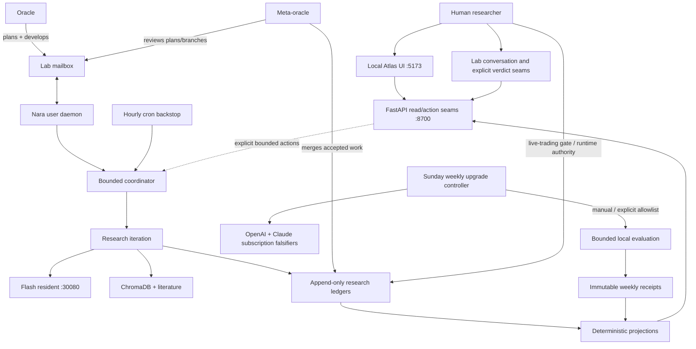
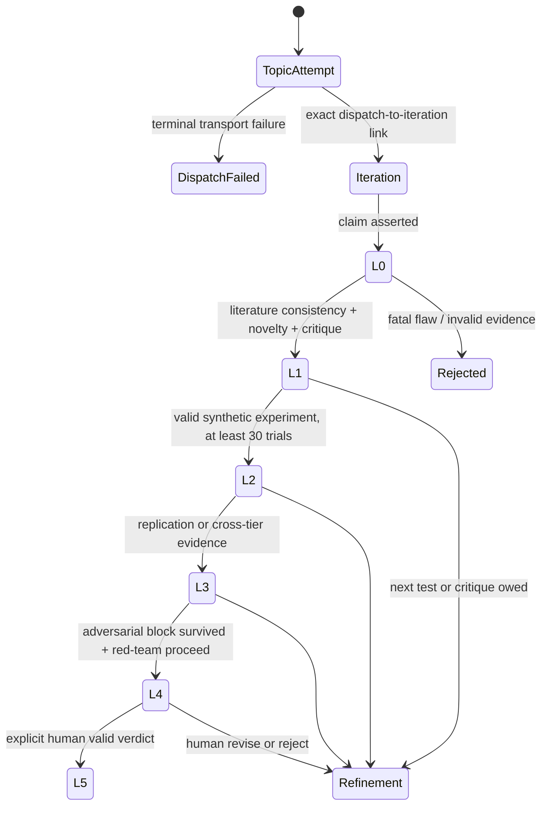

# Architecture

This document describes the deployed `a_bgt_rsi` apparatus as observed on
2026-09-23 (the Flash resident cutover of 2026-09-19 and the Oracle/Nara/
meta-oracle actor model of D-082/D-084..D-087 superseded the 2026-09-14
Gemma/Qwen snapshot) and the implemented v2 foundation and remaining design
work. It is an orientation and
integration reference. Exact launchers, current code, validated receipts, and
live read-only checks remain the evidence for a particular running process.

> **Lifecycle:** v2 retains the established serving/runtime baseline and adds
> explicit campaign identity, isolation, lifecycle receipts and progress views.
> Canonical deployment/activation receipts establish what is running. Sections
> identifying remaining targets do not claim those targets are implemented.

The May 2026 v5 SVGs in [`docs/diagrams/`](docs/diagrams/) remain useful as the
canonical conceptual snapshot adopted by D-024. Decisions D-059 through D-077
and the current implementation add material behavior that those diagrams do not
show.

## 1. Purpose and boundary

The apparatus helps one researcher form, challenge, execute, and retain work in
game theory, behavioral game theory, learning in games, and strategic behavior
among agents. Its principal product is a traceable research process. A model
response, an automated score, or a surfaced finding is evidence within that
process; none is a substitute for a human scientific verdict.

The system is designed around five invariants:

1. Preserve attempts, failures, negative results, and provenance.
2. Derive state from append-only records; never rewrite history to improve a
   result.
3. Treat missing evidence as missing, not as zero or a pass.
4. Separate model, runtime, inference-policy, scaffold, and orchestration
   effects when measuring change.
5. Keep production promotion, scientific publication, live trading, and human
   validation outside automatic model authority.

## 2. Deployed topology

The deployed model is one resident local checkpoint, **Flash**
(`nvidia/Qwen3.8-Flash-Next-NVFP4` on SGLang, `127.0.0.1:30080`, since
2026-09-19). The prior Gemma/Qwen vLLM pair (`:8000`/`:8001`) stopped that day
and is a rollback path only — see §3.1a. The owner removed any requirement for
two concurrently resident models on 2026-09-15; Flash is the single-primary
topology that requirement anticipated. See
[the Flash resident record](docs/FLASH_RESIDENT.md) and the
[model topology policy](docs/MODEL_TOPOLOGY_POLICY.md).

### 2.1 Actors

- **Oracle** (running on Flash) plans the day and develops architecture, UI,
  contracts, and its own system.
- **Nara** runs research continuously (`nara-daemon` plus an hourly cron
  backstop; no daily cap, D-085) and builds lab tools through the lane
  (`orchestrator/nara_lane.py`, a bwrap sandbox, `nara/<id>` branches).
- **The meta-oracle** (Claude Opus 5.5; `tools/meta_oracle_run.sh`) reviews
  every plan, plan item, and branch, and merges accepted work.
- **Codex sessions** hold standing repository-management authority for their
  assigned scope; see checkout-local `AGENTS.md` (not yet committed in this
  branch's base; see `README.md`'s documentation map for its status).
- The owner's only required gate is live trading (D-084). Coordination runs
  through the lab mailbox (`run_state/oracle_nara_mailbox.jsonl`,
  [docs/ORACLE_NARA_MAILBOX.md](docs/ORACLE_NARA_MAILBOX.md)); the Nara-lane
  review gate is `config/nara_lane.json`; the daily loop is
  [docs/META_ORACLE_DAILY_LOOP.md](docs/META_ORACLE_DAILY_LOOP.md). See
  DECISIONS.md D-082 and D-084 through D-087.

### 2.2 Service inventory

| Service | Current endpoint or owner | Role |
| --- | --- | --- |
| Flash resident | `127.0.0.1:30080`, `flash-resident.service` | Local generator, critic, and builder path (single resident model) |
| Nara daemon | `systemd --user`, `nara-daemon.service` | Event-driven bounded scheduler |
| Coordinator cron | `0 * * * *` | Gated belt-and-braces cycle using the daemon's lock |
| UI backend | `localhost:8700` | Read models and explicit action seams |
| UI frontend | `localhost:5173` | Local operator and research workspace |
| Telemetry sampler | `ui/.venv` process | Host/GPU/Flash observations |
| Model watchdog | every five minutes | Restarts the existing production model service only (refuses pair startup while Flash owns the GPU) |
| arXiv ingestion | daily at 03:00 UTC | Literature ingestion |
| Chroma snapshot | Sunday at 04:30 UTC | Vector-store backup |
| Weekly upgrade | Sunday at 05:30 UTC | Review-only frontier analysis and, only when allowlisted, bounded trials |

The UI `start` helper restarts all three UI processes. Operational work should
prefer status checks and targeted recovery; see
[`docs/v2/OPERATOR_GUIDE.md`](docs/v2/OPERATOR_GUIDE.md).

## 3. Hardware and serving

One DGX Spark supplies a GB10 Grace Blackwell system with 128 GB unified memory.
CPU and GPU allocations share that physical pool. The memory guard reads
`MemAvailable` and preserves a 30 GiB operating-system margin; it does not infer
free GPU memory from `nvidia-smi`. That margin applies to loading legacy or
candidate models. The running Flash resident enforces its owner-set 10 GiB
floor (see `docs/MODEL_TOPOLOGY_POLICY.md`).

CUDA 13.0 and `vllm/vllm-openai:v0.21.0` are the deployed baseline. A newer
runtime may be evaluated in an isolated challenger lane, but deployment requires
matched tests, an immutable identity, memory headroom, and a rollback. A version
number is not evidence of improvement.

### 3.1 Resident model manifest

The deployed resident is Flash. The canonical control surface is
`flash-resident.service`; `.venv-chroma/bin/python -m orchestrator.flash_resident
check-ready` performs read-only admission (supervisor boot/PID/heartbeat, exact
served model, available host memory). Full detail, boot/recovery history, and
the frozen bundle location are in [docs/FLASH_RESIDENT.md](docs/FLASH_RESIDENT.md).

| Setting | Flash |
| --- | --- |
| OpenAI-compatible URL | `http://127.0.0.1:30080/v1` |
| Exact request model | `nvidia/Qwen3.8-Flash-Next-NVFP4` |
| Checkpoint revision | `fc694b54fb0174e0913e6adf86691ef85a4ead47` |
| Runtime | SGLang image `sha256:2ee545cf877ae8497c123637e061b6e6313c624e30018f975969b1d554e27f56` |
| Capacity | 262,144 total tokens (since 2026-09-22; helper v8); runtime currently admits 32,768/262,144 per call; one running request |
| Precision | NVFP4 weights, FP32 recurrent state, BF16 KV |
| Speculation | Native NEXTN, 3 steps / 4 draft tokens |
| Resource limits | 112 GiB container cgroup (CPU-side charges only), zero container swap, 10 GiB host reserve (helper v8; was 20 GiB) |

This is a host-specific deployment (a reviewed, hash-verified local bundle),
not a portable installer. Historical benchmark notes that name Gemma, Qwen on
`:8000`/`:8001`, a 32,768-token cap, or the 20 GiB reserve as the current
production state are stale; see §3.1a for that configuration as a rollback
record.

#### 3.1a Rollback: the Gemma/Qwen pair (stopped 2026-09-19)

The prior two-model deployment is retained only as a rollback path; it is not
running. Restoring it requires stopping Flash, removing the Flash deployment
selection, restoring the old client routes, then starting the retained
containers (docs/FLASH_RESIDENT.md).

The canonical launcher was [`cron/serve-models.sh`](cron/serve-models.sh).
The table transcribes its executable flags as last validated (2026-09-14).

| Setting | Gemma | Qwen |
| --- | --- | --- |
| Served name | `gemma-4-26b-a4b` | `qwen3.8-27b-nvfp4-mtp` |
| Weights | `/models/gemma-4-26b-a4b-nvfp4` | `/models/qwen3.8-27b-nvfp4-mtp` |
| Quantization | NVIDIA NVFP4; MARLIN MoE | modelopt NVFP4, language-model-only |
| Context cap | 32,768 | 16,384 |
| Speculation | Gemma MTP assistant, 4 tokens | `qwen3_5_mtp`, 3 tokens |
| KV policy | runtime default | FP8 KV |
| Memory utilization | `0.30` | `0.30` |
| Tool parser | `gemma4` | `qwen3_coder` |
| Reasoning parser | none | `qwen3` |
| Concurrency control | batched-token cap 8,192 | max sequences 2 |

Gemma's startup log had to confirm the MARLIN NVFP4 MoE backend. The version
pins in `CLAUDE.md` inviolate rule 2 (vLLM image, CUDA 13.0, weights path)
apply to this rollback configuration; the production pin for the running
system is the Flash checkpoint revision plus the SGLang image digest above.

### 3.2 Inference policy

[`agent_wrapper/generation_policy.py`](agent_wrapper/generation_policy.py)
contains named, model-aware profiles for deterministic work, coding, science,
critique, exploration, and checked-in evaluation arms. A call opts into a
profile explicitly or through an explicit caller override. Calls that select no
new policy control preserve the legacy `temperature=0`, `top_p=1` behavior.

Profiles are experimental configuration, not global intelligence levels.
Structured tool output and open-ended hypothesis generation require different
policies. Every comparison must log the resolved model, profile, sampling,
reasoning effort, token cap, usage, terminal status, and wall time.

## 4. Research execution

### 4.1 Scheduling and gates

The Nara daemon wakes on relevant ledger changes or a bounded heartbeat. A wake
runs work only when an agent-actionable gap or accepted agenda item exists. Each
pass applies:

1. a shared single-instance lock;
2. the ratification sentinel;
3. `run_state/pause_coordinator` as the human kill switch;
4. the unified-memory preflight;
5. a bounded daily coordinator budget.

An idle wake is an honest no-op. A gate refusal is a designed outcome and is
logged. The hourly cron invokes the same coordinator path and shares the lock,
so daemon and cron do not execute a cycle concurrently.

Packet dispatch and apparatus self-improvement remain dark unless their exact
environment gates and command contracts are supplied. Nara may plan work; the
autonomous dispatcher may not merge its own patch.

### 4.2 Iteration and promotion

The stable research lifecycle is:

A core iteration generates a hypothesis, retrieves literature, classifies
novelty, critiques the claim, and writes a durable iteration record. The evolved
coordinator adds domain checks, paper-gap work, red-team/debate, evidence-ladder
projection, promotion review, bounded refinement, and memory consolidation.
These stages are not assumed to succeed merely because their model call
returned.

[`workers/evidence_ladder.py`](workers/evidence_ladder.py) is the current rung
derivation. Rungs are cumulative:

| Rung | Meaning |
| --- | --- |
| L0 | Asserted hypothesis; no earned evidence yet |
| L1 | Literature-consistent, relevant, novel (or the explicit sound surprising-vs-theory route), critique survived, no fatal red-team flaw |
| L2 | Sound synthetic experiment with the minimum trial count |
| L3 | Replication or cross-tier evidence |
| L4 | Independent adversarial review survived and red-team verdict is `proceed` |
| L5 | Human feedback explicitly records `valid` |

Only L4+ may enter `memory/surfaced_findings.jsonl`. L4 is an automatic
qualification, not a publication claim. A missing lower rung stops the climb.

## 5. Data architecture

### 5.1 Record classes

| Class | Examples | Contract |
| --- | --- | --- |
| Append-only evidence and events | `logs/calls.jsonl`, `run_state/coordinator_cycles.jsonl`, `memory/loop_memory.jsonl`, `memory/idea_ledger.jsonl`, `memory/promotion_near_misses.jsonl`, `memory/surfaced_findings.jsonl`, `memory/loop_feedback.jsonl` | Preserve original records; validate before deriving state |
| Append-only operations | `run_state/frontier_calls.jsonl`, `run_state/weekly_upgrade_budget.jsonl`, `run_state/packets.jsonl`, `run_state/overrides.jsonl` | Receipts, budget charges, and explicit control history |
| Deterministic projections | `memory/ideas.md`, active-run views, loop alert, UI read models, weekly benchmark progress | Rebuildable; never stronger than source evidence |
| Static definitions | `schema/`, `experiments/*.json`, preregistrations, model launcher | Versioned contracts and intended configurations |
| Private run artifacts | sibling weekly-upgrade run roots | Raw frontier/evaluation material; exposed publicly through sanitized hashes and summaries only |
| Historical archive | external location bound by `run_state/v2_preparation/archive_receipt.json` | Immutable copied evidence with per-file hashes and exclusions |

The active ledgers are not a database migration target. New read models should
project from them, and schema improvements should be additive until all writers
and readers have moved.

### 5.2 Lineage rules

Cross-record lineage uses explicit identifiers and hashes:

- coordinator `step_id` plus a request digest within one cycle receipt;
- dispatched iteration ID equals `loop_memory.iteration_id`;
- downstream `source_iteration_id` or `iteration_id` equals that iteration ID;
- human feedback joins through exact `iteration_id`;
- weekly summaries bind manifests, runs, evaluations, source commits, and
  receipts by SHA-256.

Topic or hypothesis substring matching is never a valid join. Duplicate IDs,
changed cohorts, missing denominators, malformed values, and ambiguous links
must remain visible or be withheld as non-comparable.

### 5.3 Known contract debt

Core records have JSON schemas, but the schema registry is incomplete and some
newer ledgers rely on code-level validation. Record timestamps, evidence
recorded-at times, and projection generation times are not consistently exposed
as separate fields. IDs exist at iteration, cluster, candidate, finding,
request, step, trial, and packet levels without one documented relationship
matrix.

V2 should close this through additive schema/version registration and a lineage
read model before considering any destructive storage consolidation.

## 6. Operator and research interface

The local UI is a read-model layer over the records above. Its principal routes
are:

| Route | User purpose |
| --- | --- |
| `/` | Current state, alerts, and triage |
| `/ladder` | Research claims by evidence rung and next test owed |
| `/dossier` | Search and read durable research records |
| `/experiments` | Evaluation and experiment evidence |
| `/development` | Operations, workers, and service state |
| `/benchmarks` | Weekly upgrade progression and selected-campaign research funnel |
| `/channel` | Attributable lab conversation and bounded actions |
| `/model-io` | Model calls and policy/usage evidence |
| `/cycles` | Coordinator cycle and step trace history |
| `/graph`, `/chain/req/:id` | Relationship and request-chain inspection |

Legacy `/ideas`, `/todo`, and `/coordinator` addresses redirect to the current
Research, Record library, and Trace history views. The backend exposes sanitized
read models and narrow action seams; the browser does not read raw private
frontier payloads.

## 7. Weekly model/runtime/policy evaluation

The weekly loop is separate from the science loop. On Sunday it snapshots the
production manifest and recent failures, asks two subscription frontier agents
for independent analysis, cross-challenges proposals, and records a review.
Most weeks should end `NO_CHANGE`.

The installed schedule is review-only when no allowlisted trial manifest is
provided. Review-only does not rerun benchmarks. A bounded trial, when explicitly
admitted, must stay within the shared 120-minute Spark ledger for the ISO week.
The controller does not promote a model, runtime, policy, or scaffold.

The `/benchmarks` projection keeps trial transport, recorded evaluation,
scientific conclusion, budget accounting, uncertainty, and cohort comparison
separate. Correct task throughput and reliable success are meaningful only when
their denominators and grader bindings are explicit. One recorded week is a
baseline, not a trend.

## 8. Operational safety

- Use `run_state/pause_coordinator` to stop new science cycles softly. Anyone may
  create it; only the human removes it.
- Use `run_state/pause_frontier` to stop frontier work and
  `run_state/pause_weekly_upgrade` to stop only the weekly upgrade controller.
- Preserve the 30 GiB unified-memory margin. Do not lower it to make a model fit.
  The running Flash resident's steady-state floor is a separate owner setting,
  10 GiB since 2026-09-21 (see `docs/MODEL_TOPOLOGY_POLICY.md`).
- `ui/scripts/ui-services.sh ensure` starts only missing UI services. Its
  `start` command deliberately stops and restarts all UI processes.
- The watchdog restarts only the existing production model service
  (`flash-resident.service`); it does not create or reconfigure it, and it
  refuses to start the retired `vllm-gemma4`/`vllm-qwen` pair while any owned
  Flash container is running.
- Runtime changes require targeted health checks, source/receipt identity,
  relevant tests, and a rollback. Repository authority alone does not authorize
  a service restart or model cutover.

## 9. V2 foundation and remaining entity work

The v2 foundation has a registered campaign/question identity, exact links
for new cycle/iteration/finding records, and a sanitized funnel on
`/benchmarks`. The target vocabulary makes the complete research journey
inspectable without rewriting historical ledgers:

```mermaid
flowchart LR
    C[Campaign] --> RQ[Research question]
    RQ --> TA[Topic attempt]
    TA --> RI[Research iteration]
    RI --> EA[Evidence assessment]
    EA --> PR[Promotion review]
    PR --> F[Finding]
    F --> HV[Human verdict]

    EC[Evaluation campaign] --> CH[Change hypothesis]
    CH --> CFG[Model/runtime/policy configuration]
    CFG --> TR[Trial]
    TR --> ER[Evaluation result]
    ER -. informs .-> C
```

The research and maintenance graphs share provenance but not verdicts. A faster
runtime does not validate a scientific finding; a strong finding does not prove
that a runtime should be promoted.

The migration remains projection-first:

1. Stable campaign and question identifiers are registered for the selected
   campaign.
2. New campaign cycles, iterations, and findings carry an exact closed link;
   legacy records remain explicitly unlinked.
3. The first read model exposes source completeness, missing linkage, lineage
   exclusions, and hash provenance.
4. Cross-page campaign navigation over existing detail records remains to be
   completed.
5. Further writer migration requires compatibility tests for old and new
   reads.

## 10. V2 activation evidence

Foundation activation requires reviewed source, compatible schemas, truthful
projections, passing tests/local smoke, an exact campaign activation pointer,
and a deployment/rollback receipt. Both cron and daemon resolve the same pointer.
The immutable campaign declaration remains `prepared`; activation and closure
are separate records so historical links never change meaning.

See [LOOP_V2 §10](LOOP_V2.md#10-foundation-activation-and-study-execution) for the
full contract. A controlled model-game study adds its own frozen manifest,
resource, analysis and literature gates. It is not implied by campaign runtime
activation, CPU calibration, or a successful engineering benchmark.

## 11. History and limits

`LOOP_V0.md` records the first literature-only slice. `LOOP_V1.md` records the
un-zombie, evidence-ladder, memory, frontier, and micro-organization build.
`PROJECT_CONTEXT.md` and the v5 diagrams explain the original program. Their
pre-v2 forms are retained in Git at `3c443e6` and in the verified archive in
[`docs/v2/RESEARCH_ARCHIVE.md`](docs/v2/RESEARCH_ARCHIVE.md).

Current known product limits are documented in
[`docs/v2/research/PRODUCT_ARCHITECTURE_AUDIT.md`](docs/v2/research/PRODUCT_ARCHITECTURE_AUDIT.md).
The largest are incomplete cross-ledger identity, dispersed research detail,
uneven schema coverage, and too little post-cutoff evidence to claim a fresh
research-pipeline trend.
