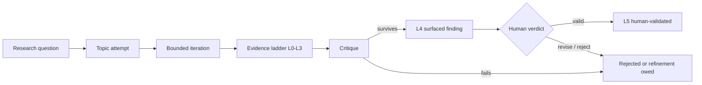

# a_bgt_rsi

`a_bgt_rsi` is a self-hosted research apparatus for game theory,
behavioral game theory, learning in games, and strategic behavior among
model agents. It runs on one NVIDIA DGX Spark and keeps the human researcher
responsible for scientific validity, deployed runtime change, and scientific
publication.

> **Current workspace — 2026-09-19:** Research follows the active campaign's
> thesis, evidence, criticism, and next agenda. Preserved records remain in the
> archive. Benchmarks uses frozen release **1.1.0**, with a verified resident
> baseline and a review boundary of **October 14**. It is a small regression
> canary; model comparisons and accepted research findings remain separate.
> The owner selected NVIDIA Flash-Next on SGLang as the permanent local model
> and ended further benchmarking. Live readiness is shown in the Now dashboard;
> selection alone does not mean a server is online. See the
> [resident operating guide](docs/FLASH_RESIDENT.md).

New contributors and agent sessions should begin with
[`START_HERE.md`](START_HERE.md).

## Selected deployment

| Layer | Configuration |
| --- | --- |
| Hardware | NVIDIA DGX Spark, GB10, 128 GB unified memory |
| Local generator, skeptic and builder | NVIDIA Qwen3.8-Flash-Next NVFP4 on `:30080`, 262K context (since 2026-09-22), one running request; shared weights across roles |
| Rollback options | Stopped Gemma 4 and Qwen3.8-27B containers |
| Serving | Pinned SGLang NEXTN3 bundle, managed by `flash-resident.service`; live status is authoritative |
| Research scheduler | user service `nara-daemon.service`, with hourly cron as a gated backstop |
| Observatory | React/Vite on `:5173`, FastAPI on `:8700`, local telemetry sampler |
| Weekly maintenance | Sunday 05:30 UTC, review-only, at most two subscription frontier calls and 120 Spark minutes per ISO week |

The exact model launch flags live in
[`cron/serve-models.sh`](cron/serve-models.sh). A model name returned by
`/v1/models`, a validated launch receipt, and current code are stronger
operational evidence than an old prose claim.

## Research flow



The loop preserves attempts and negative results. Missing evidence never counts
as a pass. Only explicit human feedback can produce L5. Frontier Claude and
Codex sessions are subscription-based falsifiers and maintenance analysts;
they are not the local generator and cannot promote their own recommendations.

## Use the system

On the Spark, open the local UI:

- `http://127.0.0.1:5173/` — current state and triage
- `http://127.0.0.1:5173/ladder` — research evidence and next test owed
- `http://127.0.0.1:5173/benchmarks` — fixed benchmark, versioned baseline and comparable run history
- `http://127.0.0.1:5173/development` — operational state
- `http://127.0.0.1:5173/cycles` — coordinator trace history

Read [`docs/v2/OPERATOR_GUIDE.md`](docs/v2/OPERATOR_GUIDE.md) before pausing,
resuming, or restarting a service. The safe first check is read-only:

```bash
ui/scripts/ui-services.sh status
systemctl --user status nara-daemon.service --no-pager
curl -fsS http://127.0.0.1:8000/v1/models
curl -fsS http://127.0.0.1:8001/v1/models
curl -fsS http://127.0.0.1:8700/api/health
```

To assess progress, use the same benchmark release and compare its individual
science, code, tool, strategy, and harness rows. A new run needs a preregistered
comparison and verified receipts; a runtime rejection or unissued arm has no
quality score. The Sunday review reads this evidence without automatically
starting another trial. See the [benchmark runbook](docs/benchmarks/stable_benchmark_v1.md)
and [current resident findings](notes/research/2026-09-16-ui-benchmark-consolidation/stable-benchmark/RESIDENT_REFERENCE_V1_1.md).

## Documentation map

| Document | Authority and purpose |
| --- | --- |
| [`START_HERE.md`](START_HERE.md) | Current orientation, reading order, and session checklist |
| [`CLAUDE.md`](CLAUDE.md) | Runtime and scientific operating constraints for Claude sessions |
| `AGENTS.md` (checkout-local) | Standing Codex repository-maintenance authority and its boundaries |
| `.codex/config.toml` (checkout-local) | Trusted project permission and approval defaults |
| [`DECISIONS.md`](DECISIONS.md) | Append-only rationale; later accepted decisions supersede earlier ones |
| [`ARCHITECTURE.md`](ARCHITECTURE.md) | System topology and implemented v2 boundary |
| [`LOOP_V2.md`](LOOP_V2.md) | V2 foundation, activation evidence, and subsequent study gates |
| [`docs/v2/OPERATOR_GUIDE.md`](docs/v2/OPERATOR_GUIDE.md) | UI, health, pause, weekly review, restart, and rollback procedures |
| [`docs/v2/IMPLEMENTATION_PLAN.md`](docs/v2/IMPLEMENTATION_PLAN.md) | Current bounded implementation and evaluation work |
| [`docs/v2/research/PRODUCT_ARCHITECTURE_AUDIT.md`](docs/v2/research/PRODUCT_ARCHITECTURE_AUDIT.md) | Evidence behind the v2 product and data-model direction |
| [`docs/v2/research/EXTERNAL_CONTEXT.md`](docs/v2/research/EXTERNAL_CONTEXT.md) | Bounded external research context for the next game-theory study |
| [`docs/v2/RESEARCH_ARCHIVE.md`](docs/v2/RESEARCH_ARCHIVE.md) | Verified v0/v1 archive identity and retrieval instructions |
| [`docs/benchmarks/stable_benchmark_v1.md`](docs/benchmarks/stable_benchmark_v1.md) | Fixed benchmark, comparison rules, review cadence, and next-run recipe |
| [`notes/research/2026-09-16-ui-benchmark-consolidation/INDEX.md`](notes/research/2026-09-16-ui-benchmark-consolidation/INDEX.md) | UI audit, Flash closure, benchmark research, and delivery receipts |
| [`LOOP_V1.md`](LOOP_V1.md), [`LOOP_V0.md`](LOOP_V0.md) | Historical build records; useful for provenance, not current orientation |
| [`PROJECT_CONTEXT.md`](PROJECT_CONTEXT.md) | Historical program background; its dated runtime claims are not current state |

The v5 SVGs under [`docs/diagrams/`](docs/diagrams/) remain the canonical
conceptual snapshot adopted in May 2026. They predate several accepted runtime
and evidence-ladder decisions, so do not use them as a live deployment manifest.

## Repository map

```text
agent_wrapper/   model backends, request policy, tool-call handling, call logs
orchestrator/    Nara, coordinator, bounded actions, weekly upgrade controller
workers/         research workers, evidence ladder, ledger reduction
pipeline/        literature ingestion and embedding
bench/           checked-in evaluation tasks, graders, runners, receipts
experiments/     preregistrations, manifests, and retained experiment evidence
schema/          versioned schemas for core public records
memory/          append-only research/evidence ledgers and derived projections
run_state/       append-only operational receipts, locks, activation and budgets
logs/            model and service event streams
ui/              local React/FastAPI observatory and telemetry sampler
docs/v2/         v2 preparation, operator guidance, archive, and research audit
human/           researcher-owned notes, verdicts, and learning material
archive/         retired implementation material retained for provenance
```

## Boundaries

- The domain remains game theory and adjacent strategic-agent research.
- The system does not infer that model behavior generalizes to humans.
- A completed transport call is not a successful scientific task.
- L4 means the automatic evidence and adversarial gates passed; it is not human
  validation. L5 requires an explicit human `valid` verdict.
- Weekly frontier analysis is review-only by default. It does not schedule a
  benchmark rerun, change a model/runtime, or promote production automatically.
- Live trading, publication, model/runtime cutovers, and removal of a human
  pause remain separately governed actions.
- Production mutations must retain a validated rollback and preserve the
  unified-memory guard.

Prior front-door documents are preserved in Git at `3c443e6` and in the
verified archive described by [`docs/v2/RESEARCH_ARCHIVE.md`](docs/v2/RESEARCH_ARCHIVE.md).
