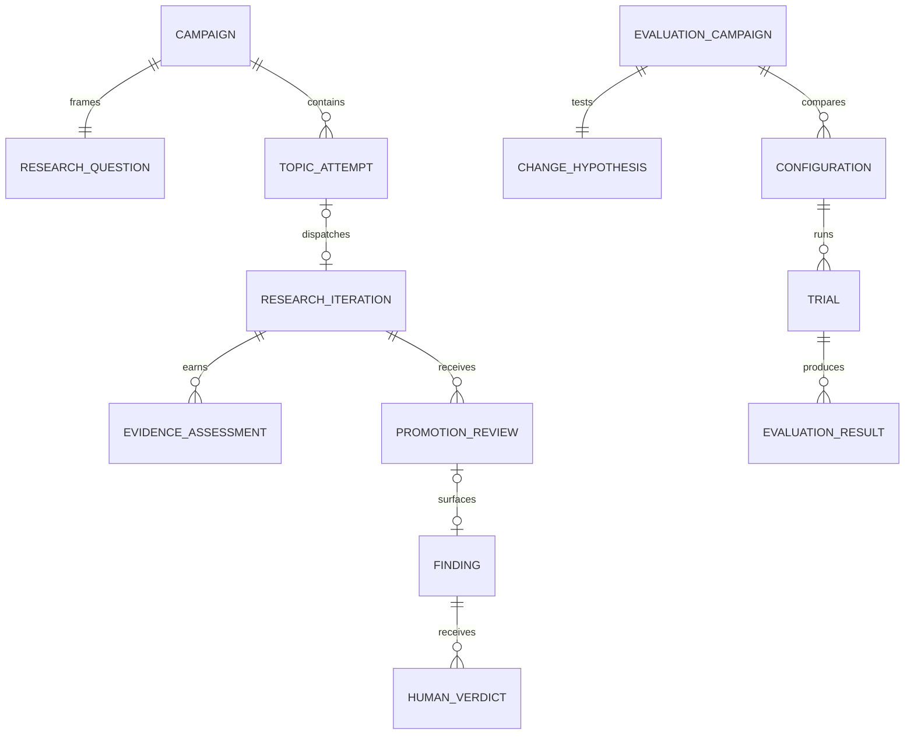

# Product and architecture audit for v2

**Audit date:** 2026-09-14
**Decision:** prepare a campaign-centered v2 through additive read models and
measured migration. Keep the evolved v1 runtime active until v2's exit criteria
pass.

## 1. Scope and evidence

This audit examined:

- the complete root front doors (`README`, `START_HERE`, `ARCHITECTURE`,
  `LOOP_V0`, `LOOP_V1`) and agent launch documentation;
- current decisions D-059 through D-077 and the affected code paths;
- model launchers, cron owners, the Nara user service, generation-policy
  resolver, evidence ladder, coordinator, weekly controller, and UI route/read
  models;
- read-only live process, port, `/v1/models`, backend health, research ladder,
  initial post-cutoff and campaign-bound pipeline projections;
- the v2 implementation plan, research archive receipt documentation, and
  bounded external context.

The archive tool verified 20,178 copied files and their hashes. That establishes
preservation coverage, not a claim that this audit semantically read all 20,178
files. Targeted searches and source inspection were used to identify active
paths and conflicts. Candidate reports and research notes retain their own dates
and evidence classes; they are not production truth.

## 2. Executive findings

The core apparatus is more capable and better governed than its front-door
documentation suggests. The primary product problem is legibility: a researcher
can inspect nearly every stage, but the stages are spread across ledgers, views,
and historical terminology. At the initial audit snapshot, exact IDs existed
locally without a first-class campaign entity. This preparation slice now adds
a hash-bound campaign manifest, exact links on new records, and a campaign
funnel; cross-page journey navigation remains incomplete.

Six findings drive the v2 direction:

1. **Orientation was materially stale.** `README.md` and `START_HERE.md` called
   LOOP_V0 active and described one model and a single-shot loop. `CLAUDE.md`
   correctly pointed to LOOP_V1. Agent prompts still point to LOOP_V0.
2. **Deployment has evolved beyond the May diagrams.** The machine has two
   resident models, an always-on daemon, an L0-L5 evidence ladder, independent
   frontier falsifiers, debate/refinement, and a weekly upgrade controller.
3. **Evidence semantics are strong but dispersed.** L4/L5 separation,
   append-only ledgers, negative-result retention, and deterministic projections
   are sound foundations. The UI needs a stable campaign spine across them.
4. **Record lineage is uneven.** Iteration, candidate, cluster, finding,
   request, step, trial, and packet IDs are present, but relationship contracts
   and schema coverage vary by source.
5. **Benchmark progress needs time, not invention.** The first recorded weekly
   cohort is a baseline. The selected campaign has no explicitly linked
   dispatch at this snapshot. Neither supports an upgrade or research-flow
   trend yet.
6. **V2 should project without rewriting history.** This slice adds campaign
   IDs, relationship links, schemas, and a read model to new records while
   classifying legacy rows as unlinked. It does not backfill lineage from time
   or topic text.

## 3. Claimed state versus observed state

| Surface | Stale or conflicting claim | Observed 2026-09-14 state | V2 treatment |
| --- | --- | --- | --- |
| Active plan | README/START/agent docs named LOOP_V0; CLAUDE named LOOP_V1 | Evolved LOOP_V1 is deployed; V2 preparation underway | One dated front door; mark V2 preparation until activation |
| Models | Single Gemma; Qwen excluded or Qwen3.6 | Gemma 4 on `:8000`; Qwen3.8 on `:8001` | Model manifest from launcher + live endpoint, not old prose |
| Orchestration | Single-shot, human-triggered | Event-driven Nara user service plus hourly gated cron | Document one gate ladder and honest no-op semantics |
| Research state | Six-step or eight-step conceptual loop | Core iteration plus domain, evidence, debate, promotion, refinement, consolidation | Campaign projection over existing stages |
| Evidence | Novelty/critic outputs were easy to read as conclusions | Cumulative L0-L5 ladder; L4 automatic, L5 explicit human | Make rung, next test, and verdict authority visible together |
| Frontier | Claude API conceptual generator/meta-review | Claude and Codex subscription CLIs are falsifiers/maintenance analysts | Keep payloads private; expose structured receipts and hashes |
| Inference | Global deterministic policy implied | Named profiles exist; legacy no-profile calls stay deterministic | Measure by role; do not silently change defaults |
| Runtime pin | Permanent version language | vLLM 0.21 is the production baseline; challengers can be evaluated | Immutable production and challenger identities with promotion gates |
| Context | Large context treated as a universal target in handoff discussions | Gemma cap 32K, Qwen cap 16K; 64K is an evaluation lane | Prefer smallest context preserving task quality |
| Weekly upgrade | No coherent progression product | Review-only Sunday workflow and benchmark projection | Accumulate comparable weeks; most decisions remain `NO_CHANGE` |
| UI | Old activity/todo/coordinator vocabulary | Atlas routes group Now, Research, Operations, benchmarks and trace; `/benchmarks` now shows the selected campaign funnel | Add cross-page campaign navigation before another top-level destination |
| Tooling | README advertised `claims_check` | Claims/SLA sweep tools were retired and archived | Remove dead references; retain retirement evidence |

One source-level inconsistency remains in `cron/serve-models.sh`: its leading
comment says Qwen remains at memory utilization `0.25`, while the executable
launch flag is `0.30`. The executable value and live process are the operational
facts; the comment should be reconciled in a separately owned change.

## 4. Product journey audit

### 4.1 Orient and triage

**Current path:** Now → Operations → Trace history/Calls.
**Works:** live health, loop alert, active/recent work, model calls, and cycle
steps are available.
**Gap:** the researcher must understand which timestamp is a projection read and
which is the underlying evidence time. Alerts and process health do not always
explain the next safe action.
**V2 requirement:** every operational card names source freshness, status
semantics, and a next inspection path. Avoid automatic mutation from a health
view.

### 4.2 Follow a research idea

**Current path:** Research ladder → Record library → Evaluations → Calls/Trace.
**Works:** evidence rung, next test owed, full iteration records, experiment
records, and lower-level traces exist.
**Gap:** the user must manually bridge cluster, iteration, finding, experiment,
and feedback identities across pages. The benchmark view now exposes the
selected campaign and exact funnel, but it is not yet a cross-page navigation
spine.
**V2 requirement:** campaign navigation projects the whole relationship graph
and links to existing detail views. It must show missing and ambiguous edges
instead of guessing them.

### 4.3 Give a human verdict

**Current path:** inspect an L4 record, then use a narrow human-action seam.
**Works:** explicit feedback is append-only; the evidence ladder reads human
validity only from that record.
**Gap:** L4 automatic qualification and L5 human validation can be collapsed in
casual language. An absence of a verdict can look like a rejection.
**V2 requirement:** show `awaiting human`, `valid`, `revise`, and `rejected` as
separate states with the exact affected finding/iteration ID.

### 4.4 Review system improvement

**Current path:** Benchmark progress → expanded family evidence → Operations and
Calls for diagnosis.
**Works:** review, execution, evaluation, semantic conclusion, uncertainty,
denominators, provenance, and budget are separated.
**Gap:** one week cannot show progression, and heterogeneous panels invite false
aggregation. The Sunday review does not automatically rerun experiments, which
must remain obvious.
**V2 requirement:** show trends only for identical cohort fingerprints; keep
single-arm historical baselines and three-arm effort pilots descriptive; link
scientific claims back to the Research/Evaluations views.

### 4.5 Recover a service

**Current path:** scripts, logs, and hand-built commands.
**Works:** explicit pause files, shared locks, memory preflight, watchdog, and
service health exist.
**Gap:** `ui-services.sh start` restarts all UI processes and is easy to overuse;
canonical UI processes have different runtimes; cron `ensure` can race a manual
recovery.
**V2 requirement:** operator guide defaults to read-only status and targeted
restart, followed by PID/cwd and API verification. Keep destructive reset out of
the normal runbook.

## 5. Data architecture audit

### 5.1 What should remain

The following foundations should be retained:

- append-only raw evidence and operations ledgers;
- cumulative evidence ladder with missing-signal stops;
- deterministic projections rather than model-generated state summaries;
- exact run/config/source hashes;
- private frontier and benchmark payloads behind sanitized public summaries;
- explicit pause, budget, activation, and terminal receipts;
- negative findings and reopening conditions;
- separate model call and task outcome records.

### 5.2 Relationship debt

Current identities include:

```text
request_id / parent_request_id / run_id
cycle_id / step_id / request_digest
iteration_id / source_iteration_id
candidate_id / cluster_id / finding_id
experiment_id / trial_id / task_id / arm_id
packet_id / branch / source_commit
```

They solve local problems but lack a single relationship contract. Some sources
carry `schema_version`; some are validated only by Python readers. A page can
therefore show a record without proving its upstream or downstream relation.

The research-pipeline projection establishes the minimum safe rule:

```text
cycle step_id + request digest in one cycle receipt
  -> dispatched_iteration_id == loop_memory.iteration_id
  -> downstream source_iteration_id == iteration_id
  -> feedback.iteration_id == iteration_id
```

Duplicate IDs, mismatched request payloads, and out-of-window records are
withheld. Text similarity is never accepted as lineage.

### 5.3 Missing-versus-zero debt

Several existing source formats cannot distinguish:

- no source file from an available empty source;
- no objective grader from zero successes;
- no human verdict from a rejection;
- no comparable history from a zero delta;
- no per-attempt duration from zero seconds.

V2 contracts should require explicit availability, nullable unknown values,
objective denominators, and named metrics. Read models should keep an unavailable
source visible rather than returning an apparently successful empty state.

### 5.4 Proposed entity model



Recommended minimal fields:

| Entity | Required identity and state |
| --- | --- |
| Campaign | `campaign_id`, scope, question ID, status, opened/closed time, prereg hash |
| Research question | immutable question text hash, domain, literature packet hash, owner selection receipt |
| Topic attempt | attempt ID, campaign ID, source, created/dispatch/terminal timestamps, terminal status |
| Research iteration | iteration ID, attempt ID, run/config identity, source commit, durable record hash |
| Evidence assessment | iteration ID, rung, next test, provisional flags, exact basis hashes |
| Promotion review | review ID, iteration ID, skeptic identity, disposition, rejection/reopening reason |
| Finding | finding ID, iteration/campaign ID, L4 basis, surfaced time |
| Human verdict | verdict ID, finding/iteration ID, explicit human actor, verdict, time |
| Evaluation campaign | evaluation ID, change surface, cohort fingerprint, promotion threshold |
| Trial/result | trial/task/arm IDs, transport and objective denominators, named metrics, hashes |

Do not copy full source payloads into relationship records. Store immutable IDs,
hashes, status, and bounded display metadata.

### 5.5 Migration sequence

1. Publish a schema/version matrix for existing records and readers.
2. Add campaign/question IDs to new records while readers tolerate their
   absence on history.
3. Write explicit relationship receipts at dispatch and promotion boundaries.
4. Build a campaign projection with availability and ambiguity accounting.
5. Link existing UI detail pages through the projection.
6. Backfill only relationships provable by exact IDs/hashes; label the rest
   `unlinked_history`.
7. Move a writer only after dual-read compatibility, fixtures, and rollback pass.

No active ledger should be truncated, renamed in place, or semantically
reinterpreted during this sequence.

## 6. Research-pipeline baseline

The first bounded audit used the corrected-runtime activation receipt. The V2
projection now adds a stronger membership boundary:

```text
campaign: v2-agentic-game-theory-20260914
campaign opened: 2026-09-14T22:16:35Z
runtime boundary: 2026-09-14T16:17:51.902964Z
membership: exact research-campaign-link/v1 only
scope: game theory, behavioral game theory, learning in games
projection status: not_yet_observed
explicit campaign topic attempts: 0
```

All required source files were available and their bounded windows were hashed.
Legacy/null, malformed, mismatched, and different-campaign rows are classified
and excluded. With complete sources and no exact campaign dispatch, downstream
counts are zero while coverage rates remain `null` because there is no attempt
denominator. The bottleneck is `dispatch`, specifically “not yet observed.”
This is neither a failed campaign nor model-study evidence.

The runtime timestamp bounds display only after a record establishes explicit
campaign membership. It never promotes an old row into the new cohort. Joins
then require recorded step, request, iteration, and campaign/topic identities.

## 7. Evaluation architecture

Keep a portfolio rather than a universal score:

1. **Transport/tool suite:** structured calls, schema, cancellation, retries,
   and error recovery.
2. **Private repository coding:** historical real tasks graded by executable
   tests.
3. **Scientific coding/reproduction:** verified or OOD tasks with execution
   evidence.
4. **Hypothesis quality:** retrieval, composition, ranking, falsifiability,
   experiment design, and self-critique scored separately.
5. **Long-horizon reproduction:** periodic, not weekly.
6. **Context:** identical evidence at 8K/16K/32K/64K; test whether added context
   improves outcomes.
7. **Research funnel:** fresh topic through human verdict, with linkage coverage.

Primary operational metrics remain Correct Task Throughput, Reliable Success
Rate, science rubric credit per hour, retries, wall time, memory, and human
interventions. Report each by task family. Do not aggregate heterogeneous pass
rates into an overall intelligence score.

## 8. Selected game-theory campaign and alternatives

The owner selected option A as campaign `v2-agentic-game-theory-20260914`:

> How do individual versus shared payoff objectives and access to
> player-identified interaction history affect cooperation and
> utility-consistent behavior in repeated public-goods games among LLM agents?

Its preregistered CPU harness recorded 81 scripted-policy assignments under
four objective/observation invariance conditions: 324 classical simulations
and zero model calls. They are not independent behavior samples. This verifies
control arithmetic and trace generation, not model behavior, novelty, or a
scientific result. The exact future model trial remains gated.

| Option | Question | Strength | Main confound |
| --- | --- | --- | --- |
| **A — selected: objective × identified history** | How do own/joint payoff objectives and own-outcome/public player-identified history change cooperation and utility consistency in a repeated public-goods game? | Clean 2×2 labels, exact payoff checks, directly matches program question | Own outcomes already reveal aggregate contributions; added information is mainly identity/history |
| B — communication × horizon | How do cheap talk and known/unknown horizon alter cooperation in a repeated dilemma? | Established theory and simple benchmark | Heavily studied; useful calibration, weak default novelty |
| C — signal reliability × mechanism | Can a mechanism preserve cooperation when agents receive asymmetric signals of controlled reliability? | Connects information design to mechanism design | More conditions and larger sample budget |

Option A is the broad prepared calibration. Independent subscription review
narrowed the first model-study extension to one LLM seat against three known
scripted opponents, with utility objective as the manipulated factor and
aggregate history, known horizon, and opponent policies stated explicitly.
Player-identity/history manipulation is deferred. The study must freeze
model/profile and seat-order identities, define utility consistency and the
limits of stage regret before the run, and separate behavioral description
from any human-generalization claim.

## 9. Prioritized decisions

| Priority | Decision | Reason | Evidence required to close |
| --- | --- | --- | --- |
| P0 | Reconcile all active-plan pointers | Conflicting entry points cause agents to execute superseded plans | Root docs, Claude contract, agent prompts, and latest decision agree |
| P0 | Observe one explicitly linked campaign topic | Current funnel has no attempt denominator | Exact campaign→attempt→dispatch→iteration receipt visible in API/UI |
| P0 | Complete the selected campaign's model-study preregistration | CPU controls do not establish model behavior or novelty | Literature gate, frozen tasks/configuration, budget, counterbalancing, strict action schema, paired analysis |
| P1 | Add schema/version relationship matrix | Cross-ledger lineage is currently reader-specific | Registry covers every v2 source and consumer |
| P1 | Add campaign projection and navigation | Research journey spans several pages | Exact relationships and missing edges visible end-to-end |
| P1 | Accumulate comparable benchmark weeks | One baseline cannot establish progress | At least two identical cohort points with named uncertainty |
| P2 | Reconcile stale comments/terminology | Low execution risk, high operator friction | Static link/reference audit and launcher comment update |
| P2 | Evaluate challenger runtime/policies | Potential compute/capability headroom | Matched incumbent comparison and regression gates |

## 10. Risks and adversarial checks

- **Self-confirming frontier advice:** frontier models propose and falsify; local
  preregistered evidence decides.
- **Model/judge circularity:** prefer executable graders; cross-provider or
  human-anchor subjective judgments.
- **Campaign ID as false certainty:** an ID proves declared relation, not causal
  validity. Preserve experiment design and grader evidence.
- **Historical backfill overclaim:** only exact ID/hash matches qualify; otherwise
  label history unlinked.
- **Projection as source:** projections remain rebuildable views. They never
  overwrite ledgers.
- **Weekly Goodhart pressure:** keep heterogeneous metrics separate and rotate
  hidden/OOD tasks.
- **Autonomous expansion:** one successful benchmark does not authorize a model,
  runtime, policy, publication, or research-promotion change.
- **Human queue ambiguity:** absence of a verdict stays pending, never rejected or
  valid.
- **Current-week optimism:** partial windows and one-point baselines do not show
  progression.

## 11. V2 product acceptance

The product architecture is ready to call v2 only when a user can:

1. open one selected campaign from Now;
2. follow every exact link from question to topic attempt, iteration, evidence,
   skeptic disposition, finding, and human verdict;
3. identify missing or ambiguous links without reading raw JSONL;
4. distinguish operational completion, automatic evidence, and human scientific
   validation;
5. compare benchmark weeks only when their cohorts match;
6. inspect source freshness and immutable provenance;
7. pause or diagnose the system through a documented safe path;
8. return to the previous deployment through a tested rollback.

The activation checklist lives in [`../../../LOOP_V2.md`](../../../LOOP_V2.md).
